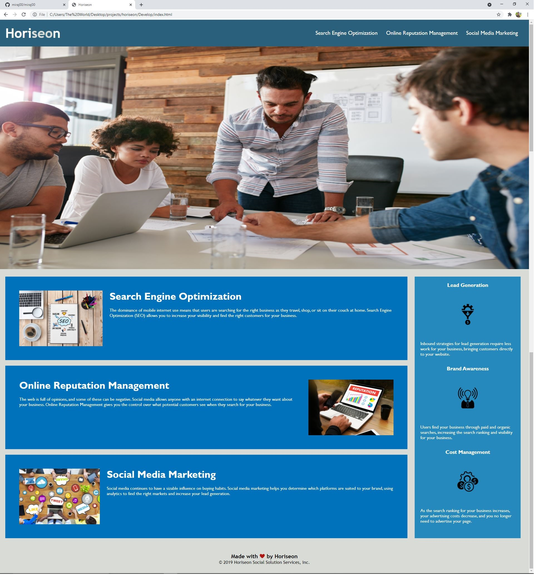

# Horiseon

Client requested to optimize their Horiseon website that meets accessibility standrad. 

*The requirement included to be fulfilled with following things to keep in mind* 

1. semantic HTML elements used    
1. elements follow a logical structure independent of style and positioning
1. have to have accesible alt atributes
1. required to fall in sequential order
1. title has to be concise and descriptive

###### After working thru the project and meeting client's requirement, below is the outcome of the project  

## Screenshot of the Project outcome as per client request ## 

[Please click here to deploy application](https://miraj00.github.io/horiseon)

